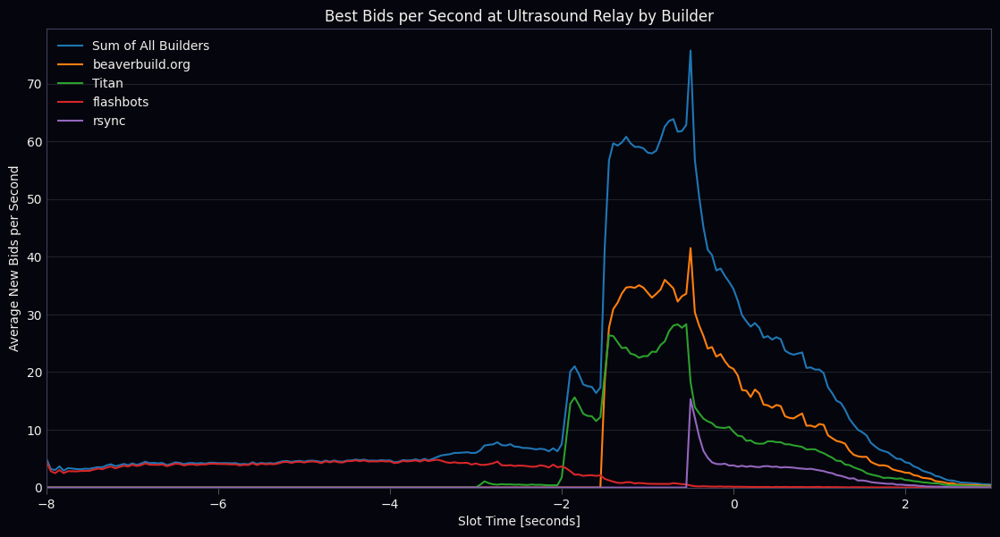

# Sample Code: The Block Auction Infrastructure Race

This repository provides sample code for some of the data analysis used in writing [The Block Auction Infrastructure Race](https://collective.flashbots.net/t/the-block-auction-arms-race/4734).

We use Ultrasound websocket data that is publicly available from the [Relayscan Bid Archive](https://bidarchive.relayscan.io/index.html). The notebook also includes instructions for adapting the analysis to full bid data collections.

## License
This work is released under the CC0 1.0 Universal license. This means you can use, modify, and distribute this project without any restriction.
